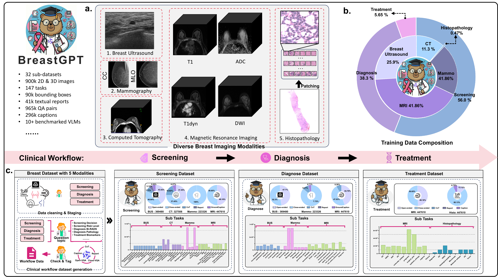
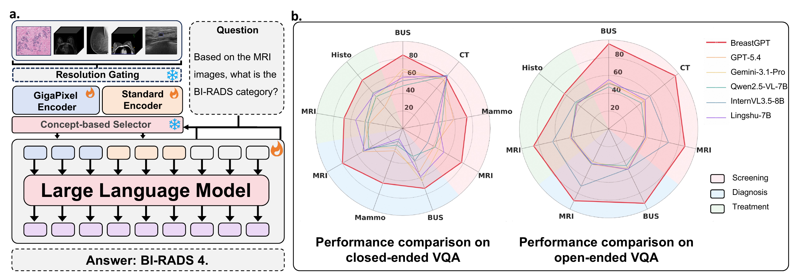

<div align="center">

# 🎀 BreastGPT

### A Multimodal Large Language Model for the Full Spectrum of Breast Cancer Clinical Routine

<p>
  <a href="#-overview"></a>
  <a href="https://anonymous.4open.science/w/BreastGPT_io/" target="_blank"></a>
  <a href="https://www.modelscope.cn/models/YYangYang/BreastGPT-8B" target="_blank"></a>
  <a href="https://www.modelscope.cn/datasets/YYangYang/BreastStage" target="_blank"></a>
  <a href="https://www.modelscope.cn/datasets/YYangYang/BreastStage-Bench" target="_blank"></a>
  <br>
  
  
  
  
  
</p>

<p>
  <b>One backbone for screening, diagnosis, and treatment planning — end-to-end across the breast cancer care continuum.</b>
</p>

<br>



</div>

---

## 📑 Contents

- [✨ Highlights](#-highlights)
- [📋 Overview](#-overview)
- [🩺 Stage-Aware Workflow](#-stage-aware-workflow)
- [🏗️ Architecture](#-architecture)
- [📊 Results](#-results)
- [🗂️ BreastStage Dataset](#-breaststage-dataset)
- [🌐 Project Page](#-project-page)
- [📂 Repository Structure](#-repository-structure)
- [🚀 Getting Started](#-getting-started)
- [🗺️ Roadmap](#-roadmap)
- [🙏 Acknowledgements](#-acknowledgements)
- [⚖️ License & Disclaimer](#-license--disclaimer)

---

## ✨ Highlights

> Real breast oncology is **not** a single classification task — it is a staged pipeline.
> BreastGPT treats it as one.

| | |
|---|---|
| 🩺 **Workflow-aligned** | First MLLM benchmarked across the **full** screening → diagnosis → treatment pipeline, not isolated tasks. |
| 🔬 **Cross-scale vision** | Dual-branch visual encoder handles **both** standard radiology (CT / MRI / BUS / mammo) and **gigapixel** WSI pathology under one architecture. |
| 🎯 **Concept-preserving compression** | Training-free coverage selector keeps clinically salient evidence inside a fixed **128-token** budget — 33× faster than no-selection on WSIs. |
| 📚 **1.86M instruction pairs** | The BreastStage corpus aligns 17 sub-datasets · 5 modalities · 136 task templates with the real clinical workflow. |
| 🏆 **SOTA on BreastStage-Bench** | **75.66% closed-ended accuracy** & **89.92% open-ended score**, beating GPT-5.4, Claude-opus-4-6, Gemini-3.1-Pro, and medical-specific VLMs. |

---

## 📋 Overview

Breast cancer management is a continuous clinical workflow spanning **screening** (mammography, breast ultrasound, chest CT), **diagnosis** (multiparametric MRI, BUS, mammography), and **treatment planning** (gigapixel pathology, staging imaging). Each stage demands different modalities, reasoning styles, and clinical vocabulary, yet existing medical MLLMs are typically built for isolated modalities or narrowly defined tasks.

We close this gap from both sides:

- **BreastStage** — a workflow-aligned breast imaging instruction corpus of **1.86M** pairs curated from 17 sub-datasets across 5 modalities and 136 task templates.
- **BreastStage-Bench** — a held-out benchmark for evaluating multimodal reasoning across the full breast care continuum.
- **BreastGPT** — a unified multimodal LLM with a dual-branch visual encoder and concept-preserving token compression, supporting all three stages under one backbone.

---

## 🩺 Stage-Aware Workflow

BreastGPT models breast oncology as a continuous clinical pipeline. At each step, a stage-conditioned system prompt switches the model's clinical role — vocabulary, reasoning chain, and target output schema — to match the current point in the **screening → diagnosis → treatment** continuum.

<table align="center">
<tr>
  <th align="center">🩺 Screening</th>
  <th align="center">🔬 Diagnosis</th>
  <th align="center">💊 Treatment Planning</th>
</tr>
<tr>
  <td align="center"><b>Stage 1</b></td>
  <td align="center"><b>Stage 2</b></td>
  <td align="center"><b>Stage 3</b></td>
</tr>
<tr>
  <td>BUS · Mammography · CT</td>
  <td>BUS · Mammography · MRI</td>
  <td>MRI · WSI (Pathology)</td>
</tr>
<tr>
  <td>BI-RADS triage<br>Suspicious lesion detection<br>Population-level risk</td>
  <td>Lesion characterization<br>Multiparametric MRI report<br>Malignancy probability</td>
  <td>Molecular subtyping<br>Biomarker profiling<br>Therapy plan</td>
</tr>
</table>

All three clinical roles share **one checkpoint** — no task-specific heads, no LoRA swaps, no separate models per stage. A real-time animation of this workflow is on the [**project page**](#-project-page).

---

## 🏗️ Architecture

<p align="center">
  
</p>

<p align="center"><sub><b>(a)</b> A resolution gating mechanism routes standard radiology to a ViT-based <b>Standard Branch</b>, and extreme-resolution WSIs to a specialized <b>GigaPixel Branch</b> (frozen CONCH v1.5 → trainable LongNet → universal concept-based token selector → LLM). <b>(b)</b> Performance comparison: BreastGPT demonstrates superior reasoning against SOTA MLLMs across both closed- and open-ended clinical QA.</sub></p>

**Key components**

| Component | Role |
|---|---|
| **Modality-aware resolution gate** | Routes radiology (CT / MRI / BUS / mammo) to the Standard Branch and WSIs to the GigaPixel Branch. |
| **Standard Branch** | Native Qwen3-VL ViT for radiological modalities. |
| **GigaPixel Branch** | Frozen CONCH v1.5 patch embeddings → trainable LongNet dilated-attention encoder for slide-level context without O(N²) cost. |
| **Concept-based token selector** | Training-free coverage maximization keeps prompt-relevant *and* visually representative tokens within a 128-token budget. |
| **Stage-aware role prompting** | A stage-conditioned system prompt switches the model's clinical role between Screening, Diagnosis, and Treatment Planning. |
| **Two-stage training** | Stage 1 warms up the perception front-end (LLM frozen); Stage 2 fine-tunes end-to-end across every modality and task format. |

---

## 📊 Results

On **BreastStage-Bench**, BreastGPT consistently outperforms proprietary frontier models, open-source VLMs, and medical-specific VLMs across every clinical stage and task format.

| Task family | BreastGPT | Strongest non-BreastGPT |
| --- | ---: | ---: |
| **Closed-ended VQA · Avg accuracy** | **75.66 %** | 54.00 % (GPT-5.4) |
| **Open-ended VQA · Avg score** | **89.92 %** | 53.64 % (InternVL3.5) |
| **BUS caption · Weighted score** | **79.32** | 47.88 |
| **MRI report · Weighted score** | **67.67** | 55.16 |
| **Histopathology report · Weighted score** | **68.11** | 51.84 |

**Inference efficiency.** On a representative histopathology WSI (5,987 patches), the **k = 128** token budget reduces total inference latency to **200.6 ms** — **33× faster** than feeding all patch tokens to the LLM directly (≈ 6.5 s). Peak GPU memory: 17.95 GB → 16.97 GB.

A full comparison against frontier, open-source, and medical-specific baselines is in the paper.

---

## 🗂️ BreastStage Dataset

A workflow-aligned breast imaging instruction corpus.

| Release | Link |
|---|---|
| **BreastStage** — training corpus | https://www.modelscope.cn/datasets/YYangYang/BreastStage |
| **BreastStage-Bench** — held-out evaluation split | https://www.modelscope.cn/datasets/YYangYang/BreastStage-Bench |

| Statistic | Value |
|---|---:|
| Instruction-following pairs | **1.86 M** |
| Unique 2D / 3D images | ≈ 662 K |
| Bounding-box / mask annotations | 606 K |
| Imaging modalities | **5** (Mammography · BUS · CT · MRI · WSI) |
| Sub-datasets curated | **17** |
| Task templates | **136** |
| Pair distribution | 57.9 % screening · 36.7 % diagnosis · 5.4 % treatment |
| Task families | Closed-ended VQA · Open-ended VQA · Grounding · Captioning · Report generation |

Data release will follow the licenses, privacy constraints, and institutional governance of the underlying datasets.

---

## 🌐 Project Page

A live, animated project page is included in this repository at [`docs/`](./docs/) and is served via **GitHub Pages** at the repository's Pages URL.

It features:

- An **8-second animated workflow** tracing Patient → Screening → Diagnosis → Treatment, with a trajectory rail that lights up cumulatively.
- Stage-aware modality previews (BUS · Mammo · CT · MRI · WSI) on each stage node.
- Full results table, ablation panels (token budget sweep, WSI latency), and qualitative case studies.

To run the page locally:

```bash
cd docs && python3 -m http.server 8765
# open http://localhost:8765
```

---

## 📂 Repository Structure

```
.
├── install.sh                          # one-shot environment setup
├── model/                              # BreastGPT model code (training-framework plugin)
│   ├── breastgpt.py                    #   ms-swift model registration
│   ├── template.py                     #   stage-aware multimodal chat template
│   └── architectures/
│       ├── breastgpt.py                #   BreastGPT model (dual-branch encoder + selector)
│       ├── modeling_qwen3_vl.py        #   Qwen3-VL backbone (patched for BreastGPT)
│       ├── longnet.py                  #   LongNet dilated-attention encoder (WSI branch)
│       ├── concept_selector.py         #   training-free coverage selector
│       ├── token_selector.py           #   visual token compression utilities
│       ├── build_model.py              #   factory: assemble model from config
│       ├── config_breastgpt_{4B,8B}*.json   # reference model configs
│       └── third_parts/                #   light-weight vendored deps (mmdet / revos)
├── thirdParty/
│   └── ms-swift/                       # vendored ms-swift fork used for training/inference
└── scripts/
    ├── swift_train_full_node.sh        # multi-node Stage-2 full-parameter training
    └── swift_infer_breastgpt_8B.sh     # batch inference over BreastStage-Bench
```

---

## 🚀 Getting Started

> Model checkpoints and the BreastStage dataset will be released after paper review and data-governance checks. The code below — the model architecture, the training plugin, and the training script — is what ships in this repository.

### 1. Install

```bash
git clone https://github.com/<your-org>/BreastGPT.git
cd BreastGPT
bash install.sh
```

`install.sh` installs the vendored `thirdParty/ms-swift` in editable mode, FlashAttention, DeepSpeed, and the radiology / pathology I/O dependencies (`nibabel`, `SimpleITK`, `h5py`, `decord`, …). Edit it to match your CUDA / PyTorch / Python ABI for the FlashAttention wheel.

### 2. Train

BreastGPT is trained with the vendored `ms-swift`, using `model/` as an external plugin that registers the `breastgpt` model type and chat template.

```bash
# multi-node Stage-2 full-parameter training
#   args: MODEL_NAME EXP_NAME PER_DEVICE_BS ACC_STEPS [TrainType] [SAVESTEPS]
bash scripts/swift_train_full_node.sh breastgpt_8B breastgpt_stage2 1 4 full 500
```

The script expects standard PyTorch elastic-launch env vars (`WORLD_SIZE`, `RANK`, `NPROC_PER_NODE`, `MASTER_ADDR`, `MASTER_PORT`) and an initial checkpoint at `model/architectures/saved_models/<MODEL_NAME>/`. NCCL / RoCE flags inside the script are tuned for an 8-GPU-per-node InfiniBand cluster; relax them for single-node runs.

### 3. Inference

After training (or after downloading the released checkpoint), `ms-swift` recognizes the registered `breastgpt` model type. Single-call invocation:

```bash
swift infer \
  --model        path/to/BreastGPT-8B \
  --model_type   breastgpt \
  --template     breastgpt \
  --external_plugins ./model \
  --infer_backend pt
```

For batch evaluation over **BreastStage-Bench**, use the bundled script — it loops through every modality / task split, applies the BreastGPT token-selector budgets, and writes per-dataset predictions:

```bash
# arg 1: model path | arg 2: max_new_tokens | arg 3: master_port
BENCH_DIR=path/to/BreastStage-Bench \
OUTPUT_DIR=./infer_outputs \
bash scripts/swift_infer_breastgpt_8B.sh path/to/BreastGPT-8B 1024
```

Tune `SELECT_IMAGE_NUM` / `SELECT_HISTO_NUM` / `SELECT_VIDEO_NUM` to control the concept-based token budget per modality. For high-throughput serving, swap `--infer_backend pt` for `vllm`.

---

## 🗺️ Roadmap

- [x] Paper submission (NeurIPS 2026 · under review)
- [x] Project page (animated workflow, results, case studies)
- [x] Model architecture code (dual-branch encoder, concept-based token selector)
- [x] Training pipeline (vendored ms-swift + multi-node training script)
- [x] BreastStage-Bench release ([ModelScope](https://www.modelscope.cn/datasets/YYangYang/BreastStage-Bench))
- [x] BreastStage training corpus release ([ModelScope](https://www.modelscope.cn/datasets/YYangYang/BreastStage))
- [x] BreastGPT-8B model checkpoint release ([ModelScope](https://www.modelscope.cn/models/YYangYang/BreastGPT-8B))
- [x] Batch inference script (BreastStage-Bench)
- [ ] Single-case inference demo
- [ ] Per-modality fine-tuning recipes

---

## 🙏 Acknowledgements

BreastGPT builds on [**Qwen3-VL**](https://github.com/QwenLM/Qwen3-VL), [**CONCH v1.5**](https://github.com/mahmoodlab/CONCH), [**LongNet**](https://github.com/microsoft/torchscale), and prior work on efficient multimodal token compression. We thank the open-source contributors whose datasets, models, and tools make this research possible.

---

## ⚖️ License & Disclaimer

**License.** Anonymous-review posture; final licensing terms will be specified at de-anonymization.

**Anonymity.** Authorship details are intentionally withheld during peer review.

**Medical disclaimer.** BreastGPT is a **research** system and is **not** intended for clinical deployment or independent medical decision-making.
